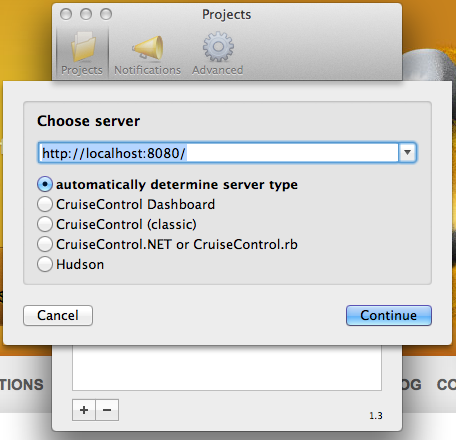

.. Jenkins Advent Calendar 2011 - Day 12 documentation master file, created by
   sphinx-quickstart on Sun Dec 11 11:29:17 2011.
   You can adapt this file completely to your liking, but it should at least
   contain the root `toctree` directive.

============================================================
Jekinsのモニタリング - Jenkins Advent Calendar 2011 - Day 12
============================================================

:Author: Shogo Kawahara <kawahara@bucyou.net> Twitter: `@ooharabucyou`_
:Date: 2011-12-12
:License: `Creative Commons Attribution 3.0 Unported License <http://creativecommons.org/licenses/by/3.0/>`_

.. _`@ooharabucyou`: http://twitter.com/ooharabucyou

この記事は `Jenkins Advent Calendar 2011 <http://atnd.org/events/22048>`_ の記事です。

`<-11日目`_ **12日目(今ここ)** 13日目->

.. _`<-11日目`: http://d.hatena.ne.jp/wadatka/20111211/1323596364
.. _`13日目->`: http://example.com

こんにちは。普段 CI Tool としては、Jenkins より `Sismo`_ を利用している ooharabucyou です。

今日は全力で小ネタなため、恐れ多い感じです。

.. _`Sismo`: http://sismo.sensiolabs.org/

CIで大事な要素の一つは、やはりフィードバックです。ビルドが失敗したときに、
ちゃんと開発者に問題を知らせる必要があります。

また、今どんな状態かも常に分かるようにしておきたいです。

本当は、 仕事場に `Lava Lamp`_ を持ち込んでみたり、
`電子工作でプロジェクト信号`_ を作ってみたり、
`Nabaztag`_ が騒ぎ出したり、 `ミサイルを同僚に飛ばしたり`_ と、
エクスクリームなフィードバックをしてみたいものですが
ひとまず、お気楽に CCMenu などを使います。

.. _`Lava Lamp`: http://blog.carlossanchez.eu/2009/01/28/using-lava-lamps-for-continuous-in/
.. _`電子工作でプロジェクト信号`: http://www.youtube.com/watch?v=mvuqLhZeha4&feature=endscreen&NR=1
.. _`Nabaztag`: http://www.youtube.com/watch?v=o5gdi-kmN-Y
.. _`ミサイルを同僚に飛ばしたり`: http://www.youtube.com/watch?v=1EGk2rvZe8A&feature=endscreen&NR=1

cc.xml
======

Jenkins には ``http://yourjenkins.example.com/cc.xml`` に、現在の Jenkins のステータスを返す
ものが存在します。どうやら、 `CruiseControl`_ の仕様に合わせた機能のようです。

.. _`CruiseControl`: http://cruisecontrol.sourceforge.net/

cc.xml 監視ツール
=================

この ``cc.xml`` を監視してくれるツールがいくつか存在します。

- `CCMenu (OS X) <http://ccmenu.sourceforge.net/>`_
- `CCTray (Windows) <http://confluence.public.thoughtworks.org/display/CCNET/CCTray>`_
- `JCCTray (Java製) <http://sourceforge.net/projects/jcctray/>`_

なんか色々ありますが、僕は Mac Book Air 使いなので、迷わず CCMenu を選びます。

`Growl <http://growl.info/>`_ に対応しているので便利です。

設定はひどく簡単で、設定で Jenkins の URLを打ち込んでやるだけです。

これだけで、メニューに今の状態を示してくれます。
この場合、1件赤いっすね。
直さないとです。

また明日
========

明日は、 cointoss1973 さんの日です。

参考記事
========

- `Monitoring Jenkins <https://wiki.jenkins-ci.org/display/JENKINS/Monitoring+Jenkins>`_
